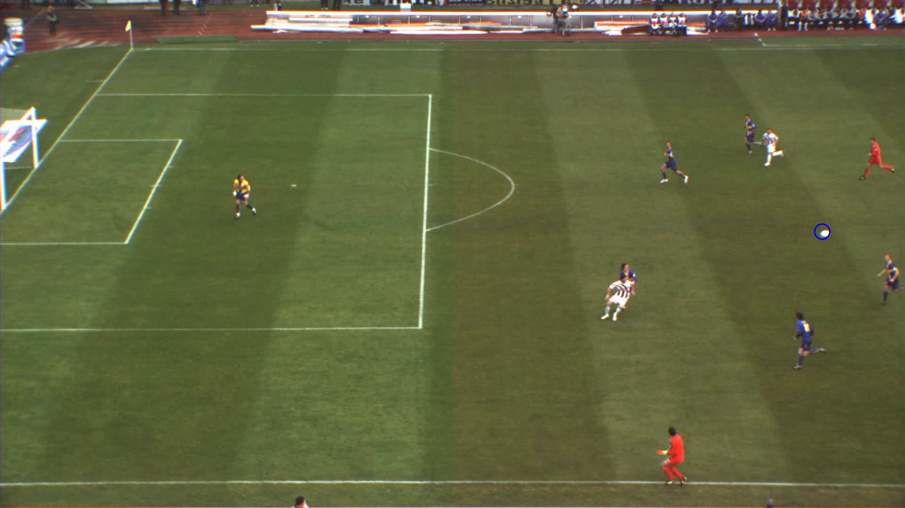

# ⚽ Deep Learning Soccer Ball Detection (DeepBall)

A computer vision project that detects and tracks a soccer ball in long-range match videos using a fully convolutional neural network.  
Built as part of my MSc project at London Metropolitan University.

> 🎯 Goal: Robust real-time detection of small, fast-moving objects under occlusion and motion blur.

---

## 🚀 Highlights

- ✅ Designed and implemented an end-to-end deep learning pipeline in a **single Python file**
- 🧠 Built a **Fully Convolutional Network (FCN)** with hypercolumn feature fusion
- 🎥 Performs ball detection on full HD soccer videos
- 📊 Achieved **87.7% Average Precision** and **95.1% accuracy** on ISSIA-CNR dataset
- ⚡ Optimized for real-time inference

- ## 🎥 Sample Outputs

Below are example frames generated by the model, where the detected soccer ball is highlighted.

  

  

---

## 🛠️ Tech Stack

- Python 3
- TensorFlow / Keras (single-file implementation)
- OpenCV
- NumPy
- imgaug
- Trained on TPU-4 (Google Colab)

> This project demonstrates skills in deep learning model design, training, evaluation, and deployment on video data.

---

## 📌 Problem

Detecting a soccer ball in long-range broadcast video is challenging because:
- The ball is very small (8–16 pixels)
- Motion blur when kicked
- Occlusions by players
- Similar colors to pitch lines and jerseys

Traditional methods fail in these cases — this project solves it using deep learning.

---

## 🧠 Solution

I developed a **Fully Convolutional Neural Network** that:
- Processes the full frame in one pass
- Produces a pixel-wise confidence map
- Uses multi-scale feature fusion (hypercolumns) for better localization
- Extracts the ball position from the peak confidence

---

## 🏗️ Architecture

- Convolution blocks for feature extraction
- Upsampling + concatenation of feature maps
- Final softmax layer → ball vs background confidence map

The network supports variable image sizes and avoids sliding-window inefficiency.

---

## 📊 Dataset & Results

**Dataset:** ISSIA-CNR Soccer Dataset  
- 20k annotated frames
- Full HD long-shot soccer videos

**Results:**
- 🎯 Average Precision: **0.877**
- 📈 Accuracy: **95.1%**
- ⚡ Faster and lighter than comparable models

---
